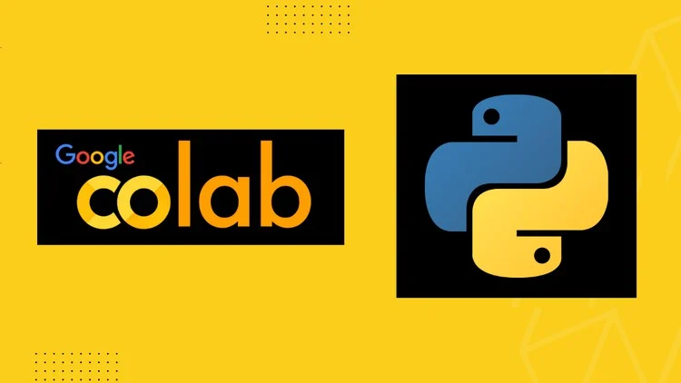

# Agentic AI - Python Course (Colab Notebooks)

Master Python effortlessly with our interactive **Google Colab-based course** designed for **beginners and aspiring AI engineers**. Learn **step-by-step** with hands-on coding exercises, real-time execution, and AI-assisted guidance. Our structured lessons make complex concepts **easy to understand and apply**. Build a **strong Python foundation** while exploring practical applications in **AI and automation**. Accelerate your learning with **engaging, error-free, and efficient coding practices**!

**[Python official documentation](https://docs.python.org/3/)**

**[Python Cheat Sheet for Beginners](https://www.datacamp.com/cheat-sheet/getting-started-with-python-cheat-sheet)**

**[Type hints cheat sheet](https://mypy.readthedocs.io/en/stable/cheat_sheet_py3.html)**

**[Python CheatSheet (2025)](https://www.geeksforgeeks.org/python-cheat-sheet/)**

**[W3 Schools Python Tutorial](https://www.w3schools.com/python/)**

**[AI Python for Beginners Course by Andrew Ng](https://www.deeplearning.ai/short-courses/ai-python-for-beginners/)**

**[Watch Python QuickStart for People Learning AI (Mini-Course)](https://www.youtube.com/watch?v=pNg2DJ4spXg)**

**[Python Interview Questions and Answers](https://www.geeksforgeeks.org/python-interview-questions/)**