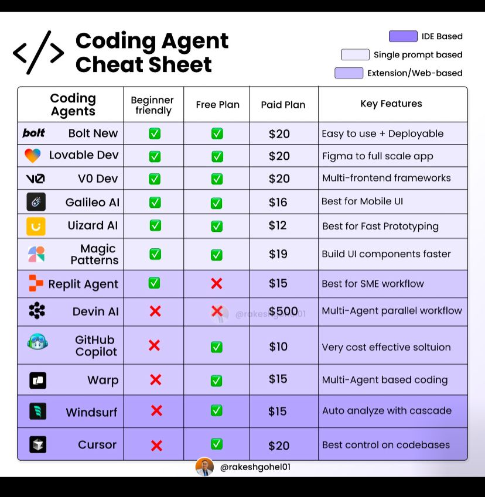

# Chat-Oriented Programming (CHOP)

[The End of Programming as We Know It](https://www.oreilly.com/radar/the-end-of-programming-as-we-know-it/)

[Chat-oriented programming (CHOP)](https://sourcegraph.com/blog/chat-oriented-programming-in-action)

Chat‐oriented programming (CHOP) is poised to radically transform the way developers work. By integrating conversational interfaces (think ChatGPT-like assistants) directly into the development workflow, CHOP promises to make developers not only faster and more efficient on an individual level (creating “10x developers”) but also to amplify team performance so that the combined output becomes exponentially greater (“100x developers”). Here’s how that transformation is expected to unfold:

1. Accelerating Individual Productivity to Create “10x Developers”

Instant Context and Rapid Problem Solving:

Traditional programming often involves long cycles of reading documentation, searching for relevant code snippets, debugging cryptic errors, or even manually tracing through a complex codebase. CHOP changes that dynamic by allowing developers to ask natural‐language questions directly in their editor. For example, when a developer encounters an error or needs clarification on a legacy function, a CHOP-enabled assistant can instantly fetch context, explain code sections, and even suggest modifications. This “on‐demand” coaching and code generation dramatically reduce time spent on low-level tasks, effectively boosting an individual’s productivity by an order of magnitude. In essence, the efficiency gains in research, debugging, and coding can turn an average developer into what many describe as a “10x developer”—someone who can accomplish in a day what would traditionally take ten days.


Streamlined Coding and Iterative Refinement:

By letting developers “chat” with their development environment, CHOP enables rapid prototyping and iterative improvement. Instead of writing code line by line and then manually testing it, a developer can quickly generate complete code snippets, get instant feedback, and iterate until the solution fits perfectly. This process minimizes friction and helps maintain high code quality even while accelerating production. The reduction in context-switching and the ability to integrate expert knowledge directly into the workflow are key factors in transforming productivity at the individual level.

2. Multiplying Impact to Create “100x Developers”

Knowledge Sharing and Team Multiplication Effects:
Once individual developers harness CHOP to become 10x productive, the benefits extend beyond personal speed. These developers can quickly solve problems and, importantly, share their insights in real time—through pair programming sessions, code reviews, or by simply leaving well-documented code. This accelerates learning for the entire team. In other words, a single “10x developer” empowered by CHOP can act as a catalyst, elevating the productivity of their peers. When team members learn from each other and adopt more efficient practices, the overall team output can multiply dramatically—reaching “100x” levels relative to teams that rely solely on traditional methods.

Coordinated, Holistic Improvements Across the Development Lifecycle:
CHOP isn’t limited to coding alone. It enhances every phase of software development:
	•	Understanding a Codebase: With a chat-enabled assistant, a newcomer can quickly grasp complex systems without wading through outdated documentation.
	•	Design and Debugging: Developers can obtain immediate explanations for errors and design decisions, reducing trial-and-error cycles.
	•	Maintenance and Refactoring: Continuous access to AI-driven suggestions helps maintain cleaner, more sustainable code, reducing technical debt over time.

The cumulative effect is that not only does each developer become significantly more productive, but the collaborative environment also becomes leaner, better coordinated, and far more innovative. When these improvements spread throughout an organization, the team (or even company-wide) productivity can be amplified exponentially—a transformation sometimes described as evolving from “10x” to “100x” performance.

3. Ecosystem Transformation

From Individual Gains to Organizational Impact:
The true power of CHOP lies in its ability to reshape the entire development ecosystem. As more teams integrate conversational AI into their daily routines, the collective impact isn’t just additive—it’s multiplicative. Enhanced individual performance, combined with improved communication, streamlined processes, and better tooling, leads to a culture where high productivity is the norm rather than the exception. Companies can then leverage this newfound agility to innovate faster, respond to market changes more swiftly, and ultimately deliver more value to customers.

In Summary

CHOP transforms software development by:
	•	First, creating “10x developers”: By drastically reducing the time needed to understand code, solve problems, and generate quality code through conversational assistance.
	•	Then, enabling “100x developers”: By amplifying individual productivity across teams through effective knowledge sharing, improved processes, and enhanced collaboration.

This two-step transformation—from boosting individual efficiency to multiplying team performance—is how CHOP is expected to revolutionize software development in the near future.

## GitHub Copilot vs Cursor

**We will be using Cursor, Github Copilot (long run), and V0 Dev**

Choosing between GitHub Copilot and Cursor depends on your specific development needs and preferences. Here’s a comparative overview to assist your decision-making:

Integration and Setup:

	•	GitHub Copilot: Seamlessly integrates as an extension within various IDEs like Visual Studio Code, IntelliJ, and Neovim. Its installation is straightforward, especially for developers already using these environments.
	•	Cursor: Functions as a standalone editor, built upon a fork of Visual Studio Code. While it offers a familiar interface, transitioning may require additional setup and adaptation.

Feature Set:

	•	GitHub Copilot:
	•	Real-Time Code Suggestions: Provides instant code completions and suggestions as you type.
	•	Contextual Awareness: Analyzes open files to offer relevant code snippets, considering imports, comments, and function names.
	•	Terminal Integration: Allows users to input commands in plain English, streamlining command execution.
	•	Cursor:
	•	Project-Wide Understanding: Comprehends the entire codebase, enabling modifications across multiple files and understanding complex project structures.
	•	AI Agent (Cursor Agent): Acts as an AI assistant capable of running commands, managing files, and handling project-wide tasks.
	•	Customization: Offers extensive customization through settings and .cursorrules files, allowing developers to tailor the tool to specific project needs.

Performance and Reliability:

	•	GitHub Copilot: Generally reliable for single-file operations and quick code suggestions. However, some users have reported occasional slowdowns with its multi-file ‘Edits’ feature.
	•	Cursor: Praised for its speed and reliability, especially in project-wide operations. Its ‘Composer’ feature efficiently handles changes across entire projects.

Pricing:

	•	GitHub Copilot:
	•	Free Tier: Limited features with up to 12,000 completions per month.
	•	Pro Plan: Starts at $10/month.
	•	Business Plan: $19/user/month.
	•	Enterprise Plan: $39/user/month.
	•	Cursor:
	•	Hobby Tier: Free with limited features.
	•	Pro Tier: $20/month.
	•	Business Tier: $40/user/month.

User Feedback:

	•	GitHub Copilot: Users appreciate its seamless integration and real-time suggestions but have noted limitations in handling large-scale project modifications.
	•	Cursor: Users value its comprehensive project understanding and customization options. Some have highlighted its superior performance in managing extensive codebase operations.

Conclusion:

If you prioritize seamless integration within your existing IDE and require quick, in-line code suggestions, GitHub Copilot may be the preferable choice. Conversely, if you seek a tool with a deep understanding of your entire codebase, extensive customization options, and robust project-wide capabilities, Cursor could be more suitable.

## [Agent Mode in GitHub Copilot](https://www.youtube.com/watch?v=zIejF3IGtWk)

The recent introduction of Agent Mode in GitHub Copilot has significantly enhanced its capabilities, bringing it closer to tools like Cursor. However, the choice between GitHub Copilot and Cursor depends on your specific development needs and preferences.

GitHub Copilot with Agent Mode:
	•	Autonomous Code Generation: Agent Mode enables Copilot to iterate on its own code, recognize errors, and fix them automatically. It suggests terminal commands and analyzes runtime errors with self-healing capabilities.  
	•	Task Inference: Beyond executing specified tasks, Copilot infers additional necessary subtasks to complete a user’s request, enhancing its ability to handle complex coding scenarios.  

Cursor:
	•	Project-Wide Understanding: Cursor comprehends the entire codebase, enabling modifications across multiple files and understanding complex project structures.  
	•	AI Agent (Cursor Agent): Acts as an AI assistant capable of running commands, managing files, and handling project-wide tasks.  
	•	Customization: Offers extensive customization through settings and .cursorrules files, allowing developers to tailor the tool to specific project needs.  

User Feedback:
	•	GitHub Copilot: Users appreciate its seamless integration and real-time suggestions but have noted limitations in handling large-scale project modifications.  
	•	Cursor: Users value its comprehensive project understanding and customization options. Some have highlighted its superior performance in managing extensive codebase operations.  

Conclusion:

The introduction of Agent Mode enhances GitHub Copilot’s autonomy and error-handling capabilities, making it a more formidable tool for developers. However, Cursor continues to excel in project-wide comprehension and customization. The choice between the two depends on your specific development needs:
	•	Choose GitHub Copilot if you prefer seamless integration within your existing IDE and value autonomous code iteration and error correction.
	•	Choose Cursor if you require deep project-wide understanding, extensive customization options, and robust project-wide capabilities.

For a visual comparison and further insights, you might find this video helpful:



